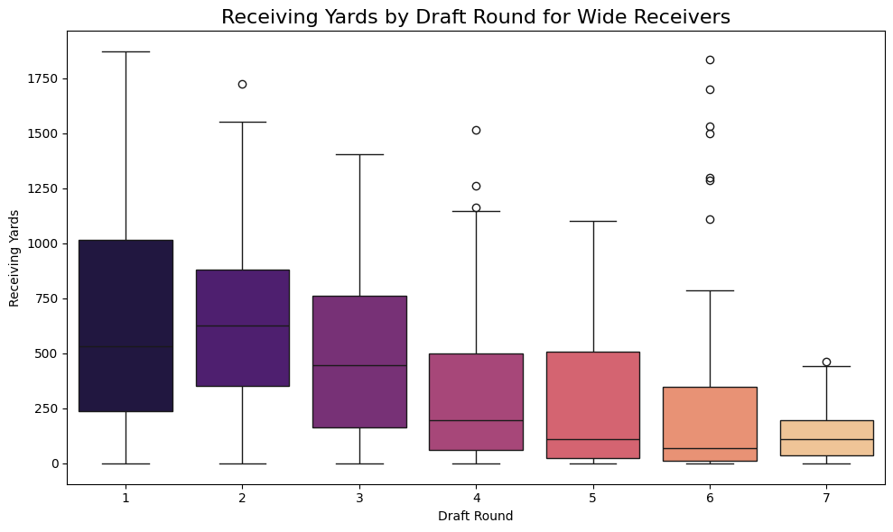
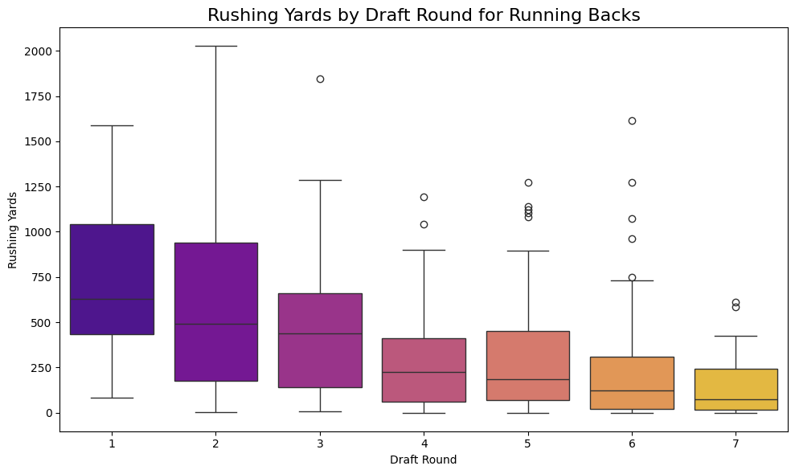
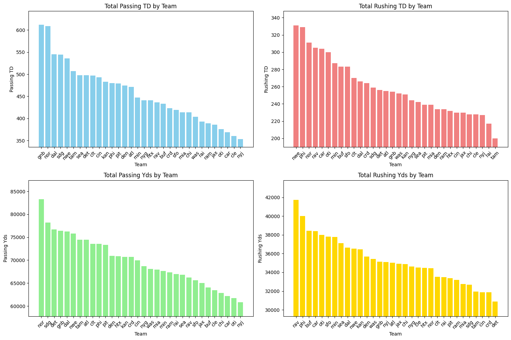
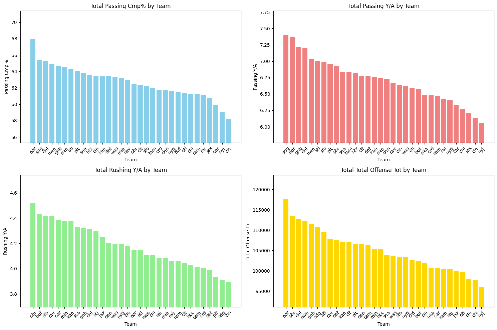
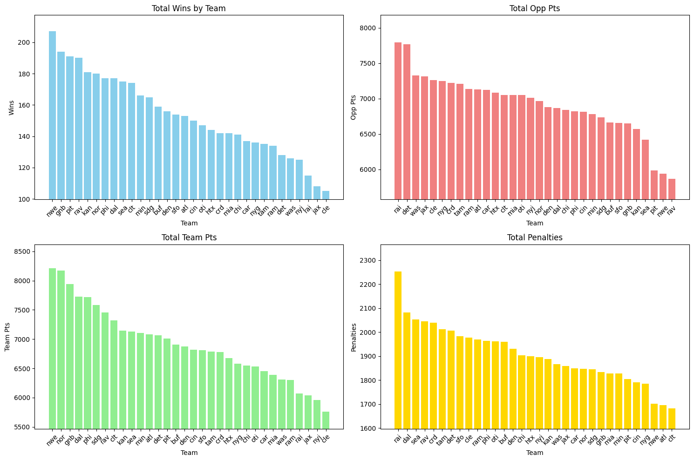
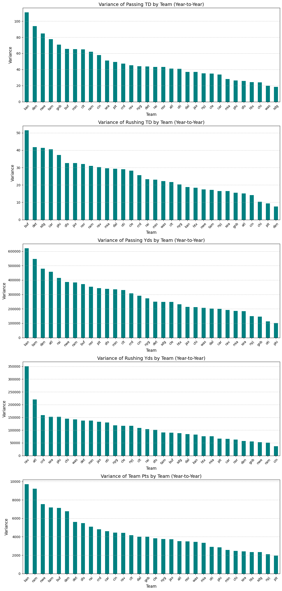
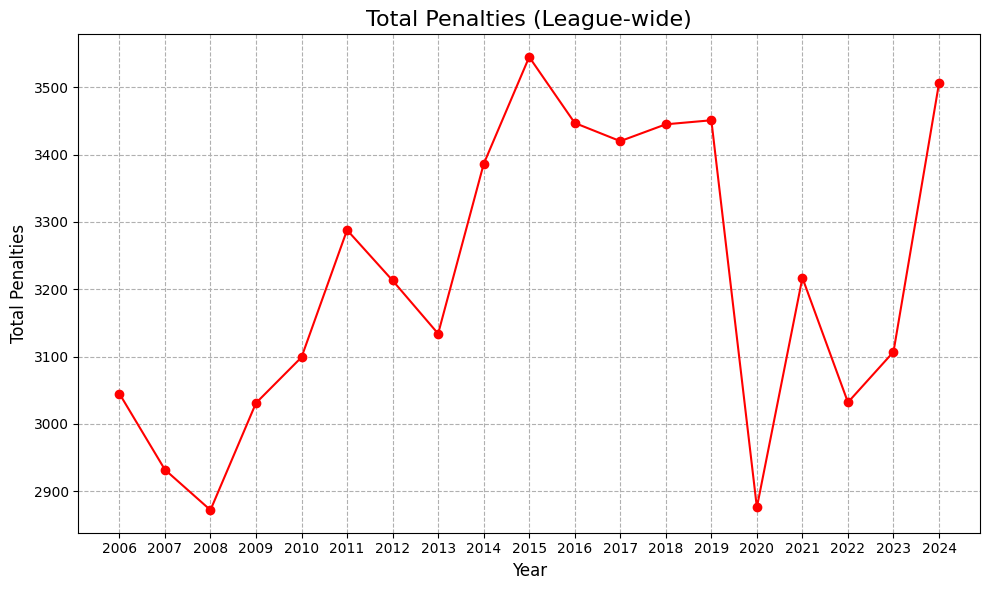
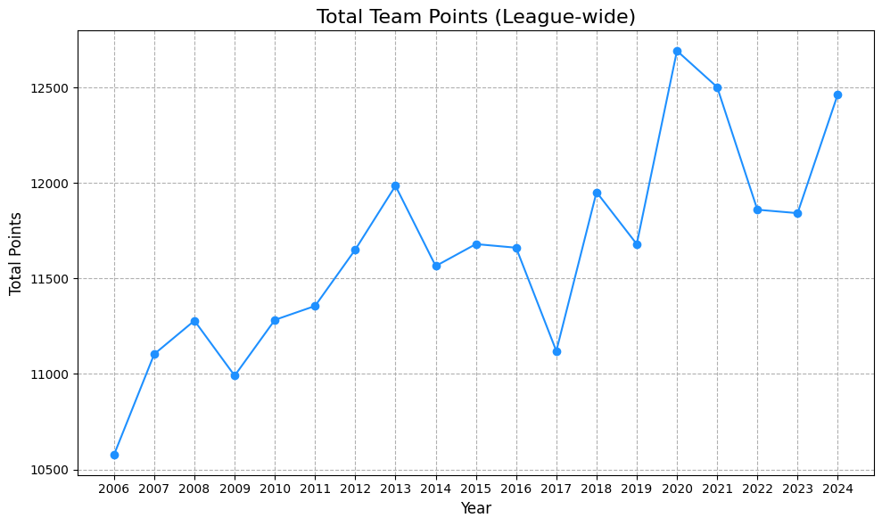
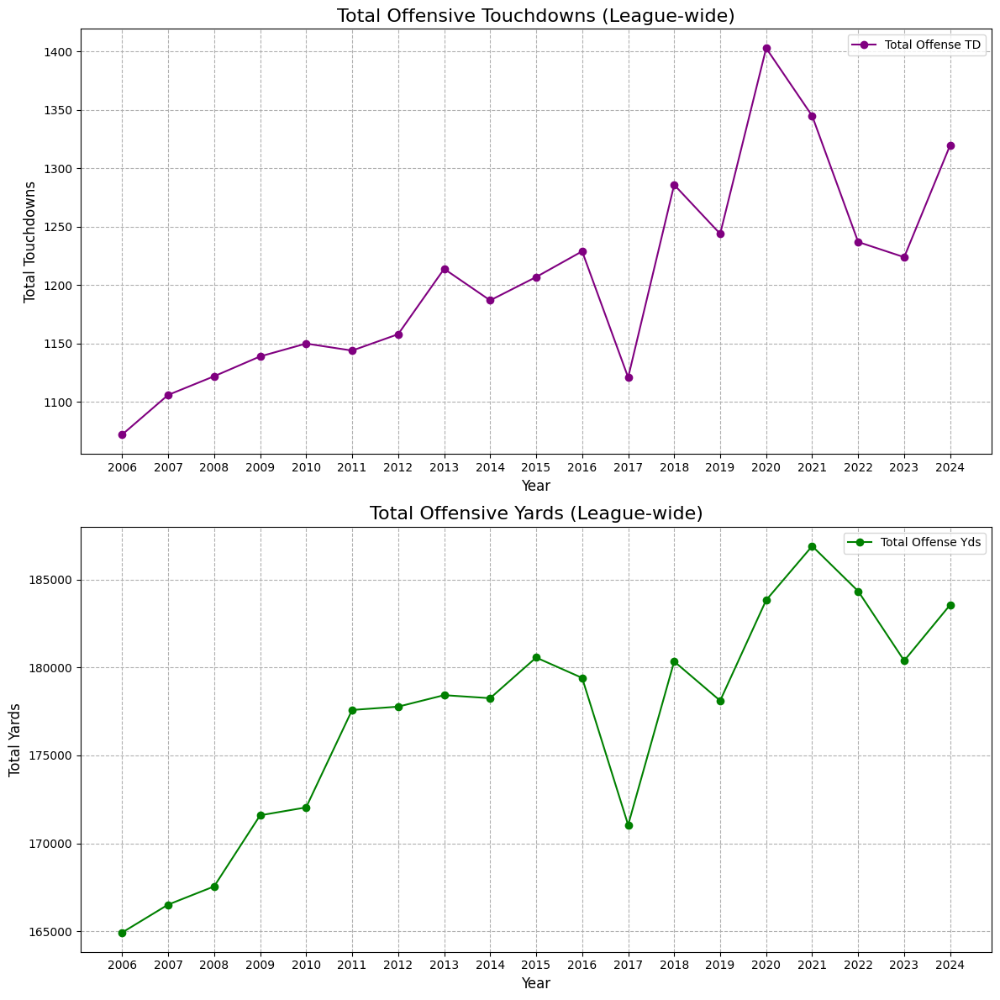
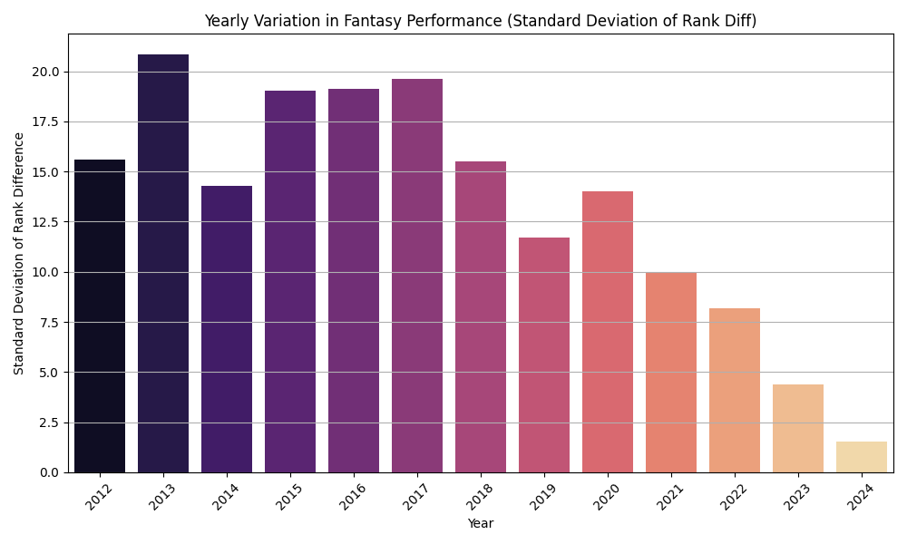

# Nfl Player and Team Analysis 
by Seth Fried
## Background
The purpose of this project was to practice gathering data, manipulating data, and drawing conclusions from the data that can inform Fantasy managers while drafting NFL players. Instead of doing a straightforward analysis one one dataset the goal was to use mutliple sources (see acknowledments) and combine them to find correlations that might not be immediatly obvious. The scope of this analysis covers both NFL players and NFL teams from 2006-2024. 

## Data
For this project I collected average draft positions (ADP) data and player game logs to see if they under or overperformed their expected value, player's college stats and combines to see if there was any correlation between their pre NFL stats and their NFL success, and finally team game logs to see how teams performed across the two decade timeline. The players that were included in this analysis were the ones that were fantasy relevant meaning they are either a tight end, wide reciever, quarter back, or running back and they played at least one snap in a season. There are also a few other pieces of data (like stadiums) that I included in the repo as I intend to do more analysis with them.
## Analysis
For the analysis I will break it up into four parts for the four jupyter notebooks I used to calculate statistics and make graphs. The four notebooks cover the ADP, combine, draft position, and team analysis.

#### ADP Analysis
The purpose of the ADP analysis was to look at a players projected Fantasy draft position and compare it to their actual ranking after the season. I got the ADP values from each year from FantasyPros and the stats from pro Football Reference. For the ADP data I had to clean the data by removing some null values, fixing some of the column names, and splitting some of the columns as the data initially had draft position, team, and round all in the same column with some unnecessary text. For the stats data I had to remove all the irrelevant players and clean up the columns as there was a lot of data that wasn't useful for my analysis. Once this was done I was able to conduct my analysis on which players under and over performed and which patterns could be found to indicate why players did better or worse. To do this I took their stats and converted them into points using standard fantasy scoring (non PPR) and then ranked the players by their position group. Next I added a column that was ADP and rank difference to see how players were doing when compared to their expected performance. Finally I made the graphs you can see below based on database I had created. 

The first graph I made looked into was the distribution of players under or overperforming:

We can see the curve is roughly centered on 0 which makes sense as we would expect roughly the same amount of players to underperform as players who overperform. 

After confirming that the distribution was roughly as expected I moved onto looking at individual under/over performers. I used 2023 data as it seemed to have some clear standouts but any year would have worked. For this year I took the players with the greatest negative difference (over-valued) and greatest positive difference (under-valued) between their ADP and rank.

One thing to note here is just because a player was under valued does not make them good for Fantasy just like an overvalued players is not necessarily bad. Some of these guys were projected for 0 points and then had average seasons which is why they appear so high on this list.

Finally I looked at the position variance in ADP vs rank which can be seen below:

These findings were quite interesting but not exactly unexpected. WR had the highest varaince followed closely by RB with a dropoff down to TE and finally QBs. As WRs have high variance in their target shares year to year it makes sense that they would have high rank variance as well. Generally TEs and QBs remain close to their predicted value as their competition is easier to predict. Its quite rare that a second string TE or second string QB suddenly takes all of their snaps so we can fairly accurately predict their rank before the season which is why the ADP is pretty accurate. 

#### Combine Analysis
For the combine analysis I took combine statistics from Pro Football Reference and looked at how accurate the combine is for predicting a players stats. Before doing this however I looked for simple trends among the combine data alone and then combined it with the NFL stats dataset. 

 As expected RB, WR, CB, and S had the lowest averages. 

As expected as weight increases the 40 yd dash time also increases.

I also made a correlation matrix for all of the combine stats vs the player stats. Most of the values here are as expected. Things like a good vertical correlate to a good braod jump, being tall correlates to weighing more, more yards per game correlates to more touchdowns per game. The only thing that was suprising here was how little stats like 40yd dash were barely correlated with rec yards or rec touchdowns. You'd expect being faster would translate to better stats but that doesn't really seem to be the case. 

After seeing how little the combine stats were correlated with nfl stats I decided to look a little closer at things like how rb dash times correlate to their rushing yards and how wr dash time correlate to their touchdowns:

For 40 yd dash times compared to rushing yards we can see the correlation line is almost horizontal indicating that the two variables have an extrememly weak relationship. There are a few less big rushing games on average after the 4.7 40 yd dash threshold but they are still all over the place. 

Likewise here there is absolutely no correlation between dash time and a wr's touchdowns which again is a little suprising but not shocking. Look at Cooper Kupp's historical 2021-2022 NFL season. Kupp is by no means the fastest wr but he still put up historical numbers due to his target share combined with route running skill. 

#### Draft Analysis
For the draft analysis I looked at some general stats like which teams had the highest draft pick on average over the last 20 years as well as some more specific ones like how good is a players pick position when predicting their nfl stats.

Over the last 20 years the Rams had the highest draft picks on average by a significant margin and the Saints had the lowest but by a smaller margin

When we look at draft round vs receiving yards we can see that early rounds have a huge range that covers both outstanding players and players who turn out to be busts. In the later rounds however the range is smaller with the highest yardage being capped at around 500 in a season. 

Similarly when we look at rushing vs draft round we can see that the early rounds have greater ranges while the later ones are more compressed and tend to show lower yardages which makes sense. 

#### Team Analysis
Here we look at all team stats compiled over the last 20 years. This is a comparison of the NFL teams to see which offenses are consistently the best, which metrics does each team excel in, and how variant are these teams year to year?

These charts show how effective the Saints offense is over the last 20 years by how high they consistently rank in each stat. It is also impressive how many passing touchdowns Green Bay had as they are right there with the Saints ahead of everyone else by a large margin. Finally the Ravens and the Eagles seemed to have the most success rushing the ball as they ranked the top of rushing yards and near the top for rushing touchdowns. 

We can see that over the last 20 years the Saints had the most passing completions and most total yards by a large marigin and were a close second in passing yards per attempt by team. One thing to note here is that the y axis of these graphs do not start at 0. I decided it was more important to look at the comparisons between teams then the actual number (because what does 120000 yards even really mean).

When we look at total wins, points, opponent points, and penalties by team over the last 20 years we can see some interesting things. The patriots had the most wins by a large margin because of their dynasty. Most opponent points scored on go to the Raiders and the Lions. Total penalties goes to the Raiders by a huge margin which is maybe how they got their reputation as being a dirty team. 

When the team variance is analyzed we can see Kansas City was by far the most variant team as they ranked at the top of almost every category. As a fantasy manager it might be worth being careful picking up offensive cheifs players as the offense might look quite different year to year. 

#### League Trends
To cap off the analysis I wanted to look at league wide trends to see how the league are changing. Things like total penalties, points scored

We can see that the total penalties are generally rising with the notable exception of a huge drop in 2020. This is most likely due to the league directive that changed how officials call and enforce penalties particularly holding calls. 

Here the total NFL points are steadily rising which makes sense as players and offenses are better adapting to scoring. One thing to note here is the drop in points in 2017. This could be because 2017 was a crucial year when defenses began to evolve and play a different defenses (like a two-high safety strategy) to stifle teams.

Following the trend above we can see total touchdowns steadily rising with the exception of the drop in 2017.

Finally I looked at variation in fantasy performance which has steadily been dropping over the years. It is quite suprising how much it has been dropping but it makes sense as models are getting better and better at predicting player performance. 

## Conclusion
In conclusion I hope this project is able to offer some insight into how the league has been evolving over the last 20 years and which metrics are the most reliable when making predictions. My takeaways would be that the combine is generally not the best way to predict performance and instead a combination of draft position and team statistics would be ideal. There are also other smaller takeaways that I had including which teams and positions had the highest variance (Kansas city and WRs) that could aid managers when doing fantasy drafts. Maybe it is a good idea to steer clear of the teams with high variance and draft high variance positions later as they are more unpredictable. 

With this being said the analysis done in this project is not conclusive and further testing would need to be done to confirm any trends. I think a future goal could be to use these insights to build a model that could predict a players under or overperformance.
### Acknowledgments
The data for this projected was from Pro Football Reference, the official NFL website, and FantasyPros.
