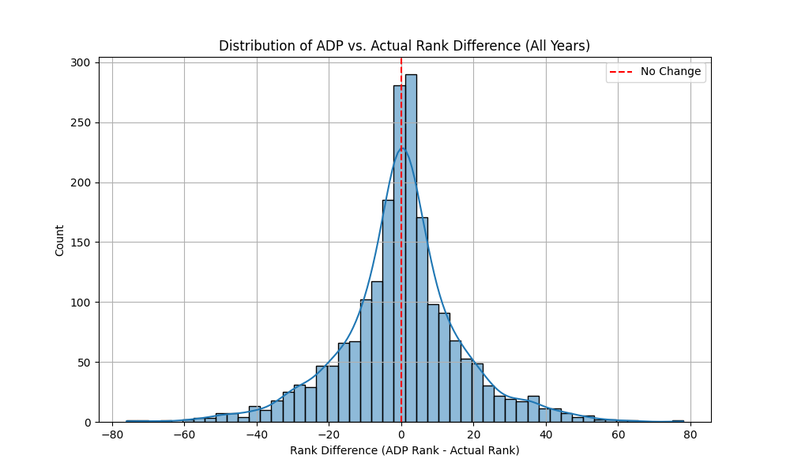
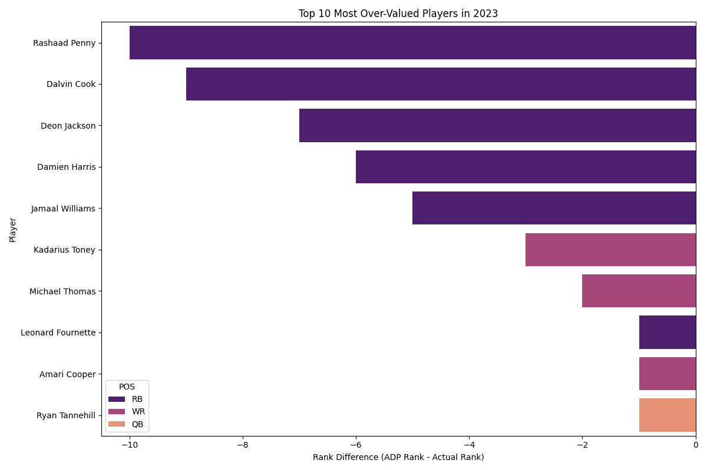
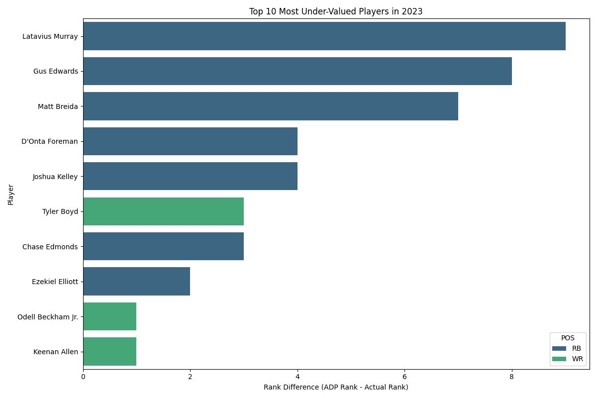
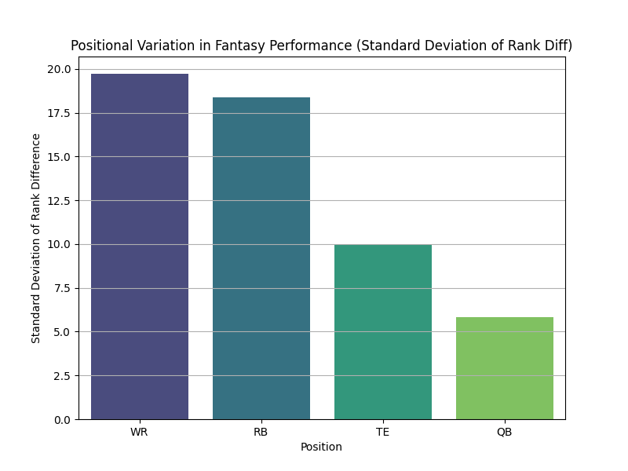
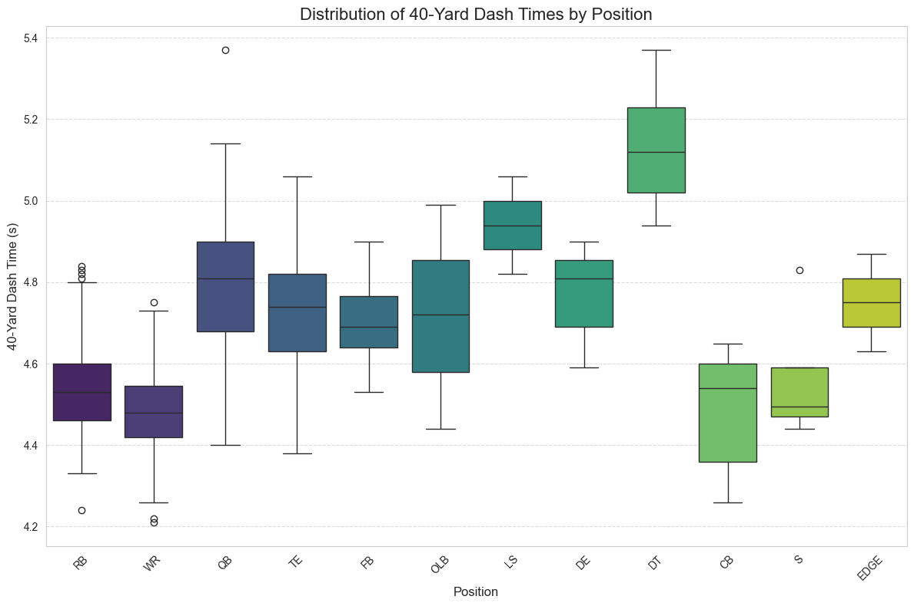
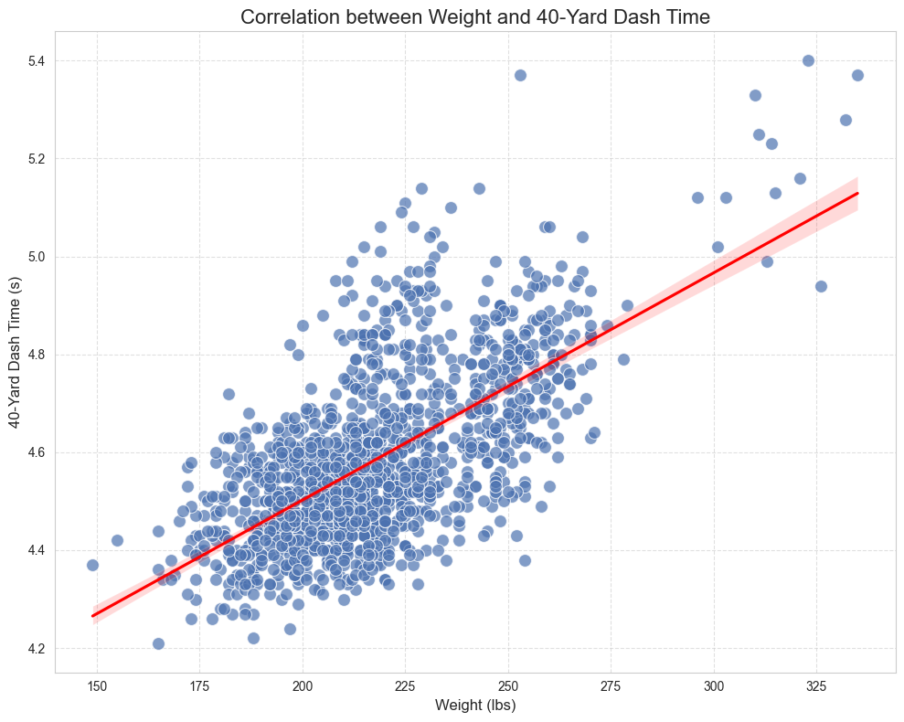
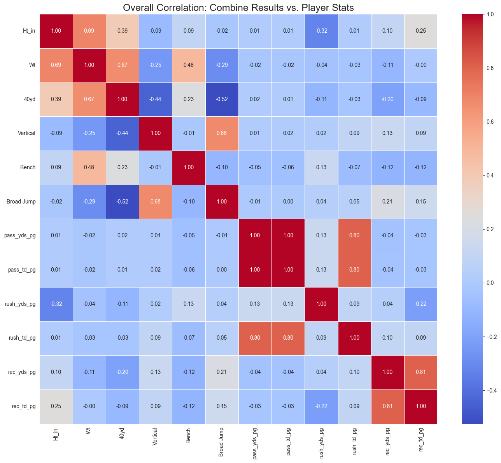
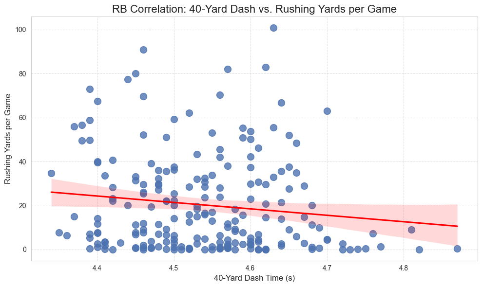
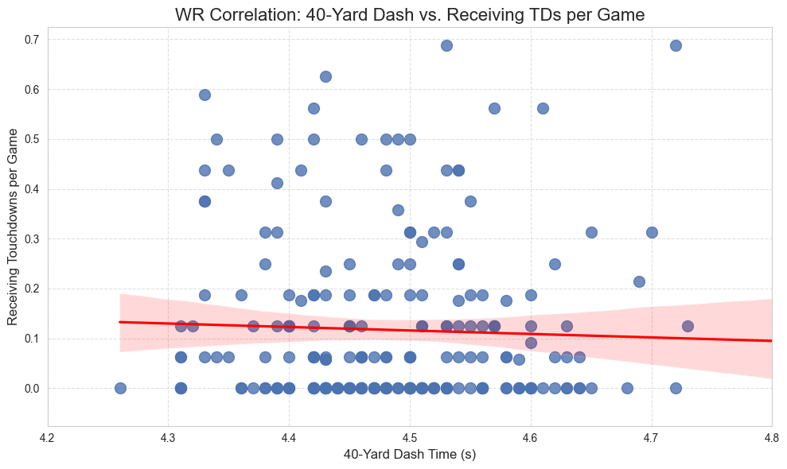

# Nfl Player and Team Analysis 
by Seth Fried
## Background
The purpose of this project was to practice gathering data, manipulating data, and drawing conclusions from the data that can inform Fantasy managers while drafting NFL players. Instead of doing a straightforward analysis one one dataset the goal was to use mutliple sources (see acknowledments) and combine them to find correlations that might not be immediatly obvious. The scope of this analysis covers both NFL players and NFL teams from 2006-2024. 

## Data
For this project I collected average draft positions (ADP) data and player game logs to see if they under or overperformed their expected value, player's college stats and combines to see if there was any correlation between their pre NFL stats and their NFL success, and finally team game logs to see how teams performed across the two decade timeline. The players that were included in this analysis were the ones that were fantasy relevant meaning they are either a tight end, wide reciever, quarter back, or running back and they played at least one snap in a season. There are also a few other pieces of data (like stadiums) that I included in the repo as I intend to do more analysis with them.
## Analysis
For the analysis I will break it up into four parts for the four jupyter notebooks I used to calculate statistics and make graphs. The four notebooks cover the ADP, combine, draft position, and team analysis.

#### ADP Analysis
The purpose of the ADP analysis was to look at a players projected Fantasy draft position and compare it to their actual ranking after the season. I got the ADP values from each year from FantasyPros and the stats from pro Football Reference. For the ADP data I had to clean the data by removing some null values, fixing some of the column names, and splitting some of the columns as the data initially had draft position, team, and round all in the same column with some unnecessary text. For the stats data I had to remove all the irrelevant players and clean up the columns as there was a lot of data that wasn't useful for my analysis. Once this was done I was able to conduct my analysis on which players under and over performed and which patterns could be found to indicate why players did better or worse. To do this I took their stats and converted them into points using standard fantasy scoring (non PPR) and then ranked the players by their position group. Next I added a column that was ADP and rank difference to see how players were doing when compared to their expected performance. Finally I made the graphs you can see below based on database I had created. 

The first graph I made looked into was the distribution of players under or overperforming:

We can see the curve is roughly centered on 0 which makes sense as we would expect roughly the same amount of players to underperform as players who overperform. 

After confirming that the distribution was roughly as expected I moved onto looking at individual under/over performers. I used 2023 data as it seemed to have some clear standouts but any year would have worked. For this year I took the players with the greatest negative difference (over-valued) and greatest positive difference (under-valued) between their ADP and rank.

One thing to note here is just because a player was under valued does not make them good for Fantasy just like an overvalued players is not necessarily bad. Some of these guys were projected for 0 points and then had average seasons which is why they appear so high on this list.

Finally I looked at the position variance in ADP vs rank which can be seen below:

These findings were quite interesting but not exactly unexpected. WR had the highest varaince followed closely by RB with a dropoff down to TE and finally QBs. As WRs have high variance in their target shares year to year it makes sense that they would have high rank variance as well. Generally TEs and QBs remain close to their predicted value as their competition is easier to predict. Its quite rare that a second string TE or second string QB suddenly takes all of their snaps so we can fairly accurately predict their rank before the season which is why the ADP is pretty accurate. 

#### Combine Analysis
For the combine analysis I took combine statistics from Pro Football Reference and looked at how accurate the combine is for predicting a players stats. Before doing this however I looked for simple trends among the combine data alone and then combined it with the NFL stats dataset. 

 As expected RB, WR, CB, and S had the lowest averages. 

As expected as weight increases the 40 yd dash time also increases.

I also made a correlation matrix for all of the combine stats vs the player stats. Most of the values here are as expected. Things like a good vertical correlate to a good braod jump, being tall correlates to weighing more, more yards per game correlates to more touchdowns per game. The only thing that was suprising here was how little stats like 40yd dash were barely correlated with rec yards or rec touchdowns. You'd expect being faster would translate to better stats but that doesn't really seem to be the case. 

After seeing how little the combine stats were correlated with nfl stats I decided to look a little closer at things like how rb dash times correlate to their rushing yards and how wr dash time correlate to their touchdowns:

For 40 yd dash times compared to rushing yards we can see the correlation line is almost horizontal indicating that the two variables have an extrememly weak relationship. There are a few less big rushing games on average after the 4.7 40 yd dash threshold but they are still all over the place. 

Likewise here there is absolutely no correlation between dash time and a wr's touchdowns which again is a little suprising but not shocking. Look at Cooper Kupp's historical 2021-2022 NFL season. Kupp is by no means the fastest wr but he still put up historical numbers due to his target share combined with route running skill. 

#### Draft Analysis
#### Team Analysis

## Conclusion
## Acknowledgments
